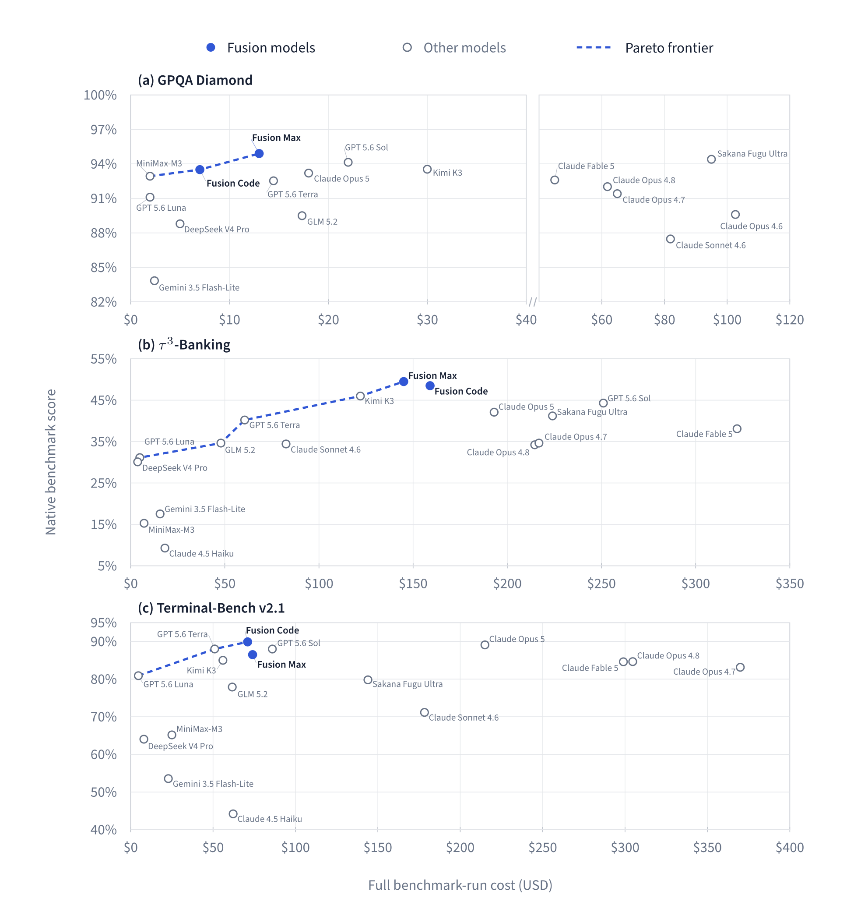

# Fusion: Allocating Intelligence Across Heterogeneous Models

*A New Scaling Dimension for AI Systems*

**Fumo Lab Technical Whitepaper · Revision 0.1 · August 2026**

Agentic systems do their work over time. Each search result, tool call, failed
attempt, or user clarification changes the task state and may change what kind
of intelligence is useful next. The available models also offer very different
combinations of expertise, reliability, failure modes, and cost.

Fusion manages this changing relationship between task demand and model supply.
It keeps a shared view of the task, identifies the uncertainty that matters to
the next decision, and selects the model-role pairing or tool call best placed
to resolve it. We refer to this as the **intelligence allocation problem**.

> Fusion aims to make system capability compound faster than frontier-compute
> consumption.

## The thesis

Two sources of progress move Fusion forward. New models expand the pool of
available capability. Experience sharpens Fusion's understanding of task state
and its judgment about where each capability is useful. These gains reinforce
each other: a stronger model pool gives the allocator more useful choices, and
better allocation extracts more value from every new model.

We see this as a new scaling dimension, where system capability can grow faster
than frontier-model compute consumption.

## Why allocation matters

A conventional router makes a model choice from the request it receives. That
works well for bounded tasks whose requirements are visible at the outset.

An agentic workflow keeps presenting new decisions after execution has begun. A
search result may settle the original question. A failed action may reveal a
constraint that was invisible in the prompt. Once an artifact exists, review or
verification may be more valuable than another attempt at generation. The
useful source of intelligence changes with the work.

A single difficulty label compresses these situations too aggressively. Fusion
works from a richer set of questions: What remains uncertain? How much does it
matter to the next action? Which available source can resolve it efficiently?
Fusion asks those questions again as the state changes, while preserving a
coherent task history.

## Performance beyond proportional compute

Figure 3 is the whitepaper's main empirical result. We plot each workload using
its native benchmark score and full-run cost, keeping the actual trade-off
visible for scientific reasoning, policy-constrained tool use, and agentic
coding.

[](assets/figure-3-score-cost-frontiers.png)

Reading guide:

- **Direction.** Better operating points sit toward the upper left: higher
  native benchmark score at lower full-run cost.
- **Markers.** Blue points represent Fusion models; hollow points represent
  other model systems.
- **Frontier.** The dashed blue line joins measured, non-dominated points. It
  simply connects those observations, with no interpolation between them.
- **Scales.** GPQA uses a marked break after $40 to make its dense low-cost
  region legible. The values remain on a linear dollar scale, as do the Banking
  and Terminal-Bench axes.
- **Comparison.** Each panel stands on its own. We do not average or normalize
  scores across benchmarks.

At least one Fusion operating point lies on the observed frontier in every
panel. That consistency matters because the three workloads stress different
capabilities and failure modes. The cost savings follow from how Fusion uses
its model pool: it reserves frontier capability for load-bearing decisions and
draws on complementary sources elsewhere.

Fusion Max and Fusion Code represent two operating profiles. Their positions
show how allocation intelligence can shift the attainable frontier and give
customers a choice of capability-cost envelopes within one system.

### Selected benchmark values

Revision 0.1 evaluates Fusion across scientific reasoning, policy-constrained
tool use, and agentic coding. Costs below are US dollars for one complete
benchmark run; lower cost and higher score are better.

| Capability regime | Fusion operating point | Selected reference points |
| --- | --- | --- |
| GPQA Diamond | **Fusion Max: 94.9% at $13** | GPT 5.6 Sol: 94.1% at $22; Sakana Fugu Ultra: 94.4% at $95 |
| τ³-Banking | **Fusion Max: 49.5% at $145** | GPT 5.6 Sol: 44.3% at $251; Sakana Fugu Ultra: 41.2% at $224 |
| Terminal-Bench v2.1 | **Fusion Code: 89.9% at $71** | Claude Opus 5: 89.1% at $215; Sakana Fugu Ultra: 79.8% at $144 |

The whitepaper reports the complete focal comparison table, a wider set of
model reference points in native benchmark coordinates, the cost definition,
data provenance, and comparability limitations. See
[`sections/05-evidence.tex`](sections/05-evidence.tex).

## Citation

Cite Revision 0.1 as a Fumo Lab technical report:

```bibtex
@techreport{zhou2026fusion,
  author      = {Shunfan Zhou and Jingqi Long and Yiling Zhang and Zhiheng Du},
  title       = {Fusion: Allocating Intelligence Across Heterogeneous Models},
  institution = {Fumo Lab},
  year        = {2026},
  month       = aug,
  note        = {Technical Whitepaper, Revision 0.1},
  url         = {https://github.com/FlockFinch-Fusion/fusion-whitepaper}
}
```

## Authors

1. Shunfan Zhou — [zhousf@fumolab.ai](mailto:zhousf@fumolab.ai)
2. Jingqi Long — [longjq@fumolab.ai](mailto:longjq@fumolab.ai)
3. Yiling Zhang — [zhangyl@fumolab.ai](mailto:zhangyl@fumolab.ai)
4. Zhiheng Du — [william@fumolab.ai](mailto:william@fumolab.ai)
